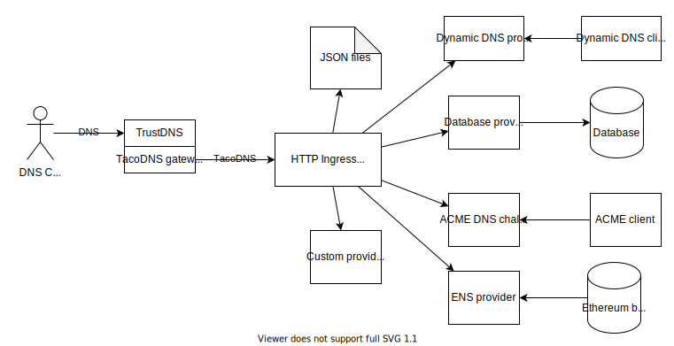

# TacoDNS

TacoDNS is a developer-friendly DNS server suite implemented in Rust.

TacoDNS is designed to simplify implementation of advanced use cases where DNS zones may be heavily dynamic or provided by a multitude of services. It also makes managing a DNS yourself easier.



## Example simple usage

TODO

## How it works

TacoDNS works by implementing an _adapter_ that converts your standard DNS protocol into an easy-to-use HTTP request. For example, the following DNS request:

```bash
dig example.com A
```

... would be converted into the following HTTP request:

```http
GET /com/example/A
```

A response to this request would look something like:

```json
["123.123.123.123"]
```

The TacoDNS adapter leverages the existing [TrustDNS](https://github.com/bluejekyll/trust-dns) library which supports dynamic backends and offers the DNS protocol support this project depends on.

### DNS over HTTPS?

The HTTP request that the TacoDNS adapter converts to is very different from the existing [DNS over HTTPS (DoH)](https://en.wikipedia.org/wiki/DNS_over_HTTPS) standard. DoH is significantly more awkward to implement against since it uses the wire DNS protocol. While this supports all the features of DNS, it makes implementation of a DNS server much less accessible to developers.

### Limitations

TacoDNS only supports a subset of DNS functionality and does not support:
- zone transfers

## Use cases

### Simplified authoritative DNS server implementation

Easily implement an authoritative DNS server that solves the needs of your specific DNS scenario.

### Flexible DNS zones

Typical DNS servers require the zone to be static as it is considered a kind of distributed database. While this is how DNS was designed, it prevents servers from responding dynamically to requests. It also introduces the synchronization problem where your application code must keep the DNS server in-sync with your application.

With TacoDNS, your application can implement an HTTP endpoint and respond to _any_ DNS request the user might make. You could, for example, respond to the random user-entered domain `jkfldsjfklsdjlk.example.com` with a redirect to `example.com`. This is not possible in existing DNS servers because there is no way the zone administrator could know what random domain the user might enter.

### Modular DNS stack

Typical DNS solutions are centralized to a single DNS server. This means that your web server, mail server, and other services that use DNS, must all be configured in the same spot. This makes combining DNS records from multiple sources complex and error prone.

TacoDNS flips the architecture around and allows you to delegate certain zones or record types out to external providers. This works similar to NS DNS records, but those only work for separate zones and not for different record types. With TacoDNS, you could, for example, delegate your A records for `example.com` to point to GitHub pages while MX records point to Gmail.

Services that integrate with DNS can begin to support their own TacoDNS HTTP endpoints, simplifying integration.

### Proxy authoritative DNS servers

Typically if an authoritative DNS server wants to delegate control to another DNS server (making it authoritative), you would use an `NS` record. This has the limitation that the entire zone must be forwarded to the other server, preventing delegation of specific record types and introduces additional steps for a recursive DNS server, slowing down resolution.

By DNS servers proxying requests to another DNS server, only certain record types can be forwarded to the other server, increasing naming flexibility.

### Point-to-point-based security

Unlike DNSSEC that uses zone signing to authenticate the contents of the DNS response, the DNS server itself is authenticated at the transport level and is automatically trusted. This simplifies integration, but can still sign records using DNSSEC for increased security.

## Features

Due to its flexibility, TacoDNS plans to implement several features including:
- Dynamic DNS (user updated IP address)
- GeoDNS (responding with different records depending on the user's location)
- DNS ACME challenge responses
- ANAME records (CNAME, but only for A records)
- URL records (simplified HTTP redirects)
- regex matching
- advanced wildcards
- prefix matching
- zone management with YAML files
- version-controlled zones in Git
- zone management with a Kubernetes CRD
- environment variable-based responses
